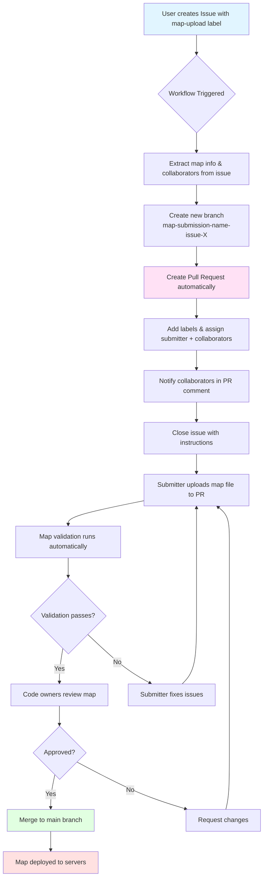
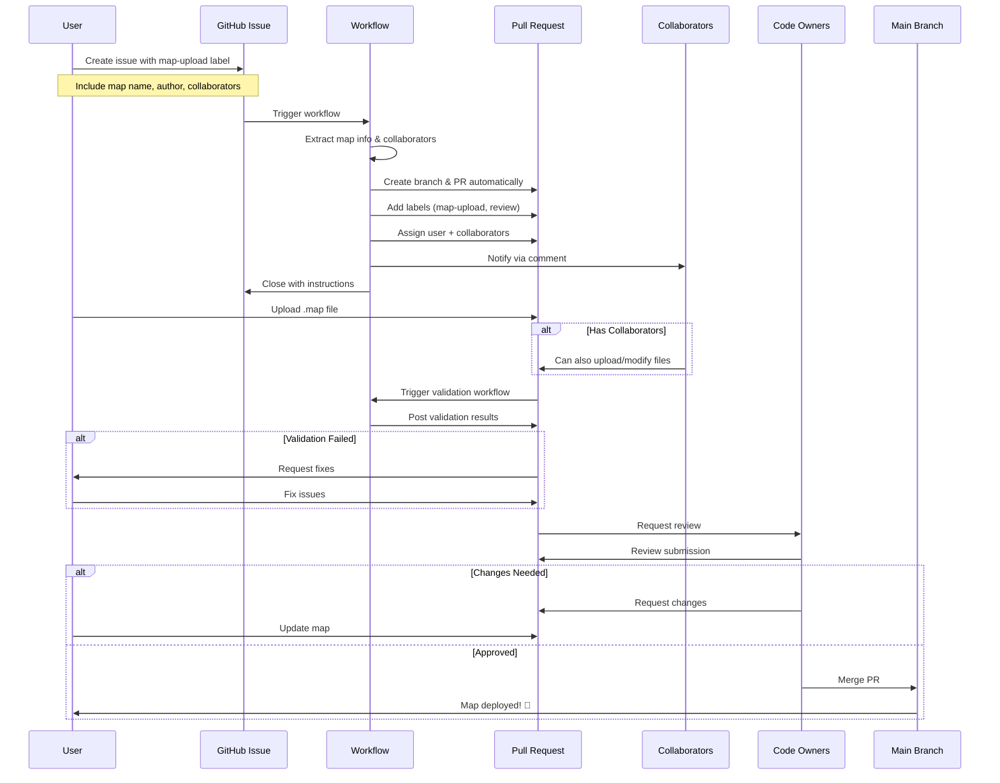

# KoG Teeworlds Maps Repository

Welcome to the KoG Teeworlds maps repository! This repository contains all community-submitted maps for KoG (King of Gores) Teeworlds servers.

## Map Submission Workflow

We've automated the map submission process to make it easy for you to contribute maps. Here's how it works:

## How to Submit a Map

### Step 1: Create an Issue

1. Go to the [Issues](../../issues) tab
2. Click "New Issue"
3. Select "Map Upload" template
4. Fill in the required information:
   - **Map Name**: The name of your map
   - **Map Author**: Your name or handle
   - **Collaborators** (optional): Add GitHub usernames of people who should be able to contribute to this submission (e.g., `@user1, @user2`)

### Step 2: Automated PR Creation

Once you submit the issue:
- A pull request is **automatically created** for you
- A new branch is created for your submission
- The issue is closed with instructions
- You and your collaborators are assigned to the PR
- Collaborators are notified and can contribute

### Step 3: Upload Your Map

1. Navigate to the automatically created pull request
2. Click on "Files changed" tab
3. Click "Add file" → "Upload files"
4. Upload your `.map` file to the appropriate directory (e.g., `maps/`)
5. Remove the placeholder README file
6. Commit your changes

**Note**: Both you and your collaborators can upload files to the PR!

### Step 4: Automated Validation

Once you upload your map:
- Automated checks will validate your map
- You'll see the results in the PR
- Fix any issues if the validation fails

### Step 5: Review & Merge

- Code owners (@Avolicious) will review your submission
- They may request changes or approve the map
- Once approved, your map will be merged to the main branch
- Your map will be deployed to KoG servers!

## Workflow Diagram (Detailed)

## Permissions & Access Control

### Who Can Do What?

| Role | Can Upload to PR | Can Review | Can Merge |
|------|-----------------|------------|-----------|
| **Submitter** | ✅ Yes | ❌ No | ❌ No |
| **Collaborators** | ✅ Yes | ❌ No | ❌ No |
| **Code Owners** | ✅ Yes | ✅ Yes | ✅ Yes |
| **Others** | ❌ No | ❌ No | ❌ No |

### Branch Protection

The `main` branch is protected with the following rules:
- Pull request reviews required before merging
- Status checks must pass (map validation)
- Code owner approval required (@Avolicious)
- Only code owners can merge

### Collaborator Access

When you add collaborators to your map submission:
- They receive a notification in the PR
- They can push to the PR branch
- They can upload and modify files
- They work together with you on the map

To contribute as a collaborator:
1. Fork the repository (if not already done)
2. Fetch the submission branch
3. Make changes and push
4. Or use GitHub UI to upload files directly

## Need Help?

- Check the [PERMISSIONS.md](.github/PERMISSIONS.md) for detailed access control info
- Open a discussion in the [Discussions](../../discussions) tab
- Contact the code owners: @Avolicious

## Contributing

Thank you for contributing to the KoG Teeworlds community! Every map submission helps make the game more enjoyable for everyone.

Happy mapping! 🎮🚀
